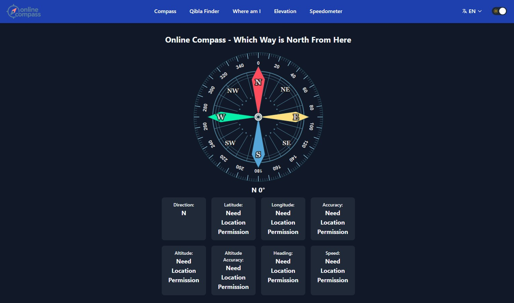

# OnlineCompass.me - online Compass & GPS Tool

A modern, responsive web-based compass application that uses your device's sensors to provide accurate directional guidance and location information directly in your browser.

## 🧭 Try the Live Demo: [Online Compass](https://onlinecompass.me)



## ✨ Features

- **Real-time Compass**: Accurate directional readings using device magnetometer
- **GPS Location Data**: Display latitude, longitude, altitude, and accuracy
- **Speed & Heading**: Real-time speed and heading information
- **Dark/Light Theme**: Automatic theme switching with smooth transitions
- **Mobile Optimized**: Responsive design that works on all devices
- **No Installation Required**: Works directly in any modern web browser
- **Privacy First**: All data processed locally, nothing stored on servers
- **Offline Ready**: Functions without internet connection once loaded

## 🚀 Quick Start

### Option 1: Use Online
Simply visit **[Online Compass](https://onlinecompass.me)** - no download required!

### Option 2: Run Locally
```bash
# Clone the repository
git clone https://github.com/injec/onlineCompass.me.git

# Navigate to project directory
cd onlineCompass.me

# Open in browser
open index.html
# or simply drag index.html to your browser
